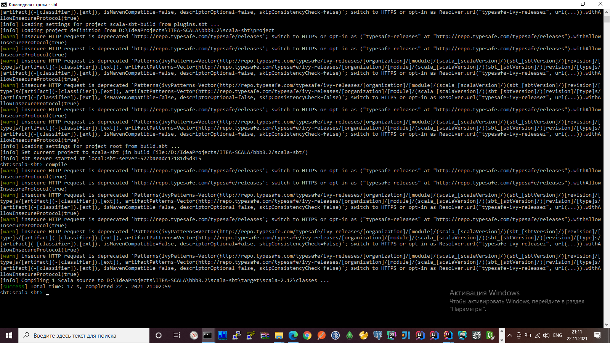
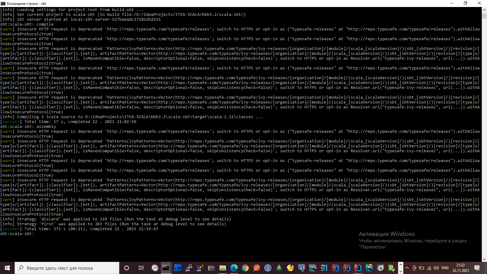
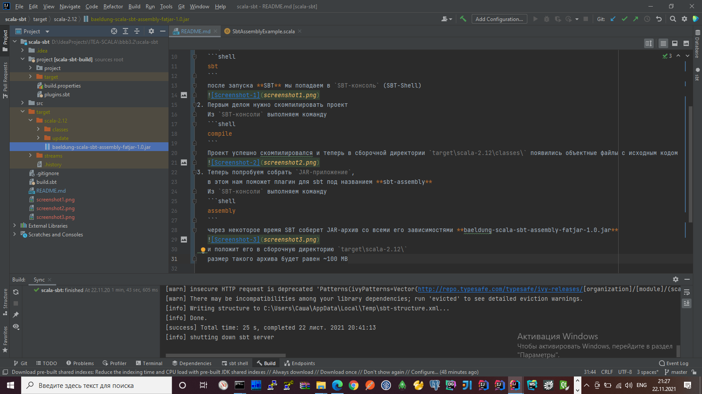

# Scala SBT tutorials | Creating a Fat JAR Using SBT

### How to create a self-contained jar file (fat jar) using sbt

* `Tutorial-1`: https://eax.me/scala-sbt **(** https://andres.jaimes.net/scala/how-to-create-a-fat-jar **)**
* `Tutorial-2`: https://www.baeldung.com/scala/sbt-fat-jar
  * `Scala/SBT: How to deploy a single, executable Jar file (sbt-assembly)` https://alvinalexander.com/scala/sbt-how-build-single-executable-jar-file-assembly
* `Repo-2`: https://www.baeldung.com/scala/sbt-fat-jar  **(** https://github.com/Baeldung/scala-tutorials/tree/master/scala-sbt **)**
  * `Repo`: https://github.com/sbt/sbt-onejar
* `sbt Reference Manual` https://www.scala-sbt.org/1.x/docs/sbt-by-example.html
* `sbt Download` https://www.scala-sbt.org/download.html

1. Перейти в корень проекта и запустить **SBT**
   ```shell
   sbt
   ```
   после запуска **SBT** мы попадаем в `SBT-консоль` (SBT-Shell)
   
2. Первым делом нужно скомпилировать проект
   Из `SBT-консоли` выполняем команду
   ```shell
   compile
   ```
   Проект успешно скомпилировался и теперь в сборочной директории `target\scala-2.12\classes\` появились объектные файлы с исходным кодом
   
3. Теперь попробуем собрать `JAR-приложение`,
   в этом нам поможет плагин для sbt под названием **sbt-assembly**
   Из `SBT-консоли` выполняем команду
   ```shell
   assembly
   ```
   через некоторое время SBT соберет JAR-архив со всеми его зависимостями **baeldung-scala-sbt-assembly-fatjar-1.0.jar**
   
   и положит его в сборочную директорию `target\scala-2.12\`
   размер такого архива будет равен ~100 MB
   
4. Теперь это обычный исполняемый jar-файл
   и запустить его можно стандартной командой `Java`
   ```shell
   java -jar baeldung-scala-sbt-assembly-fatjar-1.0.jar
   ```
   
   А результат выполнения приложения, например: будет печать строки в консоль...
5. Если заглянуть во внутрь JAR-архива `baeldung-scala-sbt-assembly-fatjar-1.0.jar` можно прочитать МЕТА-файл **META-INF/MANIFEST.MF** с данными о проекте
   ```text
   Manifest-Version: 1.0
   Implementation-Title: scala-sbt
   Implementation-Version: 1.0
   Specification-Vendor: scala-sbt
   Specification-Title: scala-sbt
   Implementation-Vendor-Id: scala-sbt
   Specification-Version: 1.0
   Main-Class: com.baeldung.scala.sbt.SbtAssemblyExample
   Implementation-Vendor: scala-sbt
   ```


---

* [GitHub * Personal access tokens](https://mail.google.com/mail/u/0/?tab=rm&ogbl#inbox/KtbxLwgswrfxtLZJbFzLlPHzglccGQBXXV)

**(** https://snipboard.io **)**
