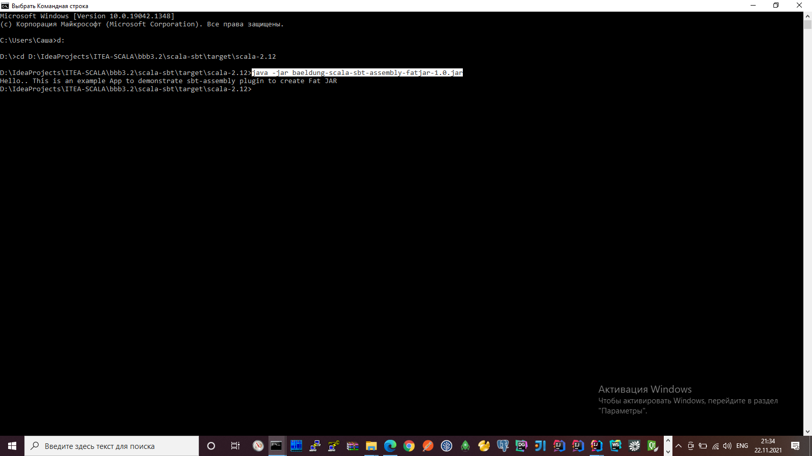

# Scala SBT tutorials | Creating a Fat JAR Using SBT

### How to create a self-contained jar file (fat jar) using sbt

* `Tutorial`: https://eax.me/scala-sbt **(** https://andres.jaimes.net/scala/how-to-create-a-fat-jar **)**
* `Repo`: https://www.baeldung.com/scala/sbt-fat-jar

1. Перейти в корень проекта и запустить **SBT**
   ```shell
   sbt
   ```
   после запуска **SBT** мы попадаем в `SBT-консоль` (SBT-Shell)
   
2. Первым делом нужно скомпилировать проект
   Из `SBT-консоли` выполняем команду
   ```shell
   compile
   ```
   Проект успешно скомпилировался и теперь в сборочной директории `target\scala-2.12\classes\` появились объектные файлы с исходным кодом
   
3. Теперь попробуем собрать `JAR-приложение`,
   в этом нам поможет плагин для sbt под названием **sbt-assembly**
   Из `SBT-консоли` выполняем команду
   ```shell
   assembly
   ```
   через некоторое время SBT соберет JAR-архив со всеми его зависимостями **baeldung-scala-sbt-assembly-fatjar-1.0.jar**
   
   и положит его в сборочную директорию `target\scala-2.12\`
   размер такого архива будет равен ~100 MB
   
4. Теперь это обычный исполняемый jar-файл
   и запустить его можно стандартной командой `Java`
   ```shell
   java -jar baeldung-scala-sbt-assembly-fatjar-1.0.jar
   ```
   
   А результат выполнения приложения, например: будет печать строки в консоль...


---

**(** https://snipboard.io **)**
